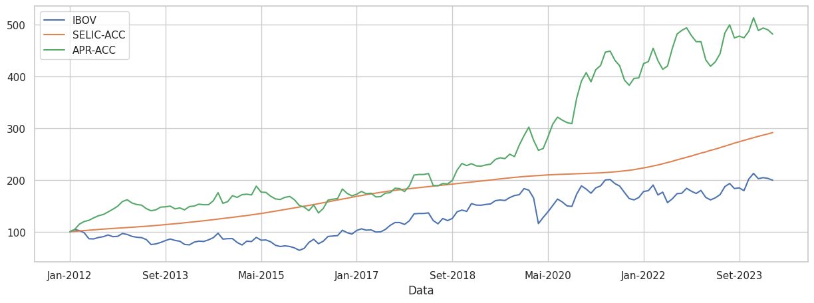
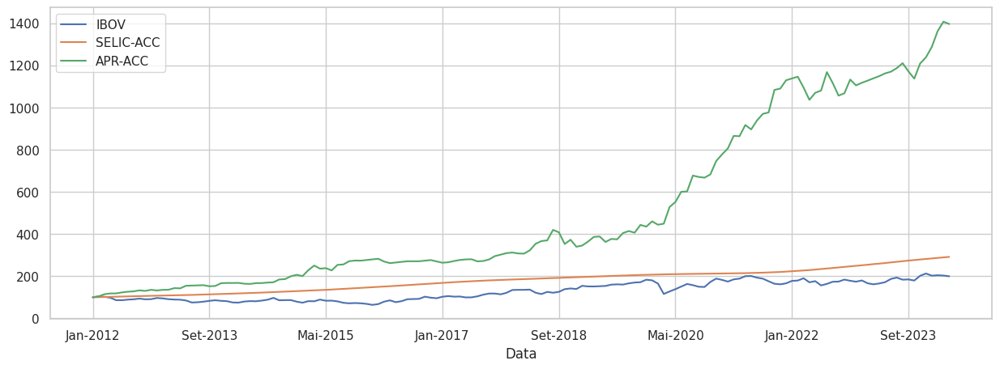

 

  
  <h3 align="center">Alocação Sistemática com Machine Learning</h3>
  

    Este repositório explora a aplicação de modelos de Machine Learning, como <strong>Random Forests e Multi-Layer Perceptron</strong>, na alocação sistemática de ativos financeiros, analisando a performance de portfólios compostos por <strong>'IBOV', 'SELIC-ACC', 'IMAB' e 'SP500BR'</strong>.
  

## Introdução à Alocação Sistemática
- Alocação Sistemática é uma abordagem de investimento que utiliza regras predefinidas e modelos quantitativos para determinar a distribuição ideal dos ativos em um portfólio.
- Ao incorporar Machine Learning nesse processo, buscamos identificar padrões complexos nos dados históricos que possam melhorar a performance do portfólio, ajustando a alocação com base em previsões feitas por modelos avançados.

## Metodologia Aplicada
- O código em Python, localizado no notebook `main.ipynb`, aplica algoritmos de <strong>Random Forests e Multi-Layer Perceptron (MLP)</strong>, ambos da biblioteca `sklearn`, para prever o desempenho futuro de um conjunto de ativos financeiros e ajustar a alocação do portfólio em conformidade.
- Os ativos analisados incluem <strong>IBOV, SELIC-ACC, IMAB, e SP500BR</strong>, oferecendo uma diversidade de exposição ao mercado local e internacional, além de renda fixa e variável.

## Pontos Chave do Código
- Coleta e Preparação de Dados:
    - Os dados históricos dos ativos são carregados e pré-processados para serem usados nos modelos de Machine Learning. Isso inclui normalização dos dados e criação de features derivadas dos preços e indicadores financeiros.

- Treinamento dos Modelos:
    - Dois modelos principais são implementados:
        - Random Forests: Um modelo ensemble que utiliza múltiplas árvores de decisão para melhorar a precisão preditiva e reduzir o risco de overfitting.
        - Multi-Layer Perceptron (MLP): Um tipo de rede neural artificial que aprende padrões complexos através de múltiplas camadas de neurônios.
    - Os modelos são treinados com validação cruzada para garantir que as previsões sejam robustas e aplicáveis em diferentes períodos de mercado.

- Implementação da Estratégia de Alocação:
    - Os modelos preditivos são usados para gerar previsões de retorno para os ativos analisados. Com base nessas previsões, o código ajusta a alocação do portfólio dinamicamente, buscando maximizar o retorno ajustado ao risco.

- Avaliação de Desempenho:
    - O desempenho da estratégia é avaliado usando métricas como Curva de Capital, Retorno Acumulado, e Drawdown. Os resultados são comparados com estratégias tradicionais de buy-and-hold.

## Resultados e Gráficos
Após a aplicação dos modelos e ajustes de alocação, são gerados gráficos que ilustram o desempenho do portfólio sob as diferentes estratégias de Machine Learning.

Gráfico da Performance usando Random Forests

  

Gráfico da Performance usando Multi-Layer Perceptron

  

